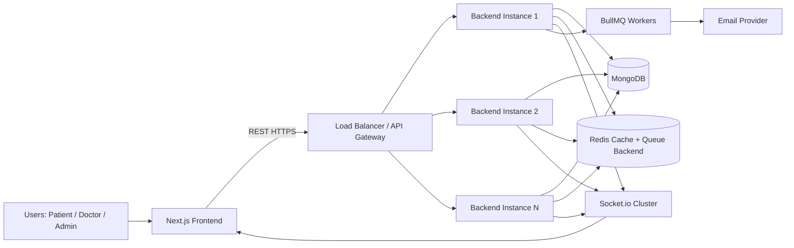

# MediSync System Design & Scalability Playbook

This document explains the architecture and the next evolution path for MediSync as if mentoring a junior engineer through real production scaling.

## Step 1: System Design Enhancement

### 1.1 High-Level Architecture



### 1.2 Data Flow: Appointment Booking

1. Patient picks doctor/date/time on frontend.
2. Frontend sends `POST /api/appointments`.
3. Backend validates request body (Zod).
4. Backend executes atomic slot booking (`findOneAndUpdate` with upsert).
5. If slot already exists, backend returns `409 Conflict`.
6. If created, backend schedules reminder job in BullMQ.
7. Frontend shows success and refreshes appointments.

### 1.3 Data Flow: Video Consultation

1. User opens consultation page and gets camera/mic stream.
2. Frontend joins socket room with appointment ID.
3. Signaling (offer/answer/ICE) passes via Socket.io.
4. Peer-to-peer media flows over WebRTC after signaling.
5. Chat events (`chat:message`) are emitted in room.
6. On disconnect, socket emits `user-disconnected`.

### 1.4 Scale Improvements for 100K+ Users

1. Run backend statelessly behind load balancer.
2. Use Redis for cache + distributed coordination + queue storage.
3. Move Socket.io to sticky sessions or Redis adapter.
4. Add dedicated worker tier for email/reminders.
5. Add MongoDB read replicas for heavy read endpoints.
6. Add CDN for frontend assets and image delivery.

---

## Step 2: Scalability Improvements

### 2.1 Horizontal Scaling Strategy

- Keep app stateless (JWT and externalized Redis/Mongo state).
- Run multiple backend replicas.
- Use autoscaling by CPU + request latency.

### 2.2 Load Balancing Concept

- Use NGINX/ALB as API entry.
- Enable sticky sessions for Socket.io transports if needed.
- Use health checks on `/health`.

### 2.3 Database Query & Index Optimizations

Applied:
- Unique slot index: `{ doctor, date, time }`.
- Patient listing index: `{ patient, date: -1 }`.
- Doctor dashboard index: `{ doctor, status, date: -1 }`.

### 2.4 Microservices Transition Path

Move from modular monolith to services when operational pressure increases:

1. `auth-service`
2. `appointment-service`
3. `notification-service`
4. `realtime-service`

Keep API Gateway in front and use event bus for cross-service notifications.

---

## Step 3: Performance Optimization

### 3.1 Current API Performance Snapshot

- Existing code was missing request timing at middleware level.
- Added middleware now logs `durationMs` + status + endpoint.
- Added `/metrics` endpoint for lightweight operational visibility.

### 3.2 Redis Caching Improvements

Applied:
- `GET /api/users/doctors` now uses read-through caching (`users:doctors:list`, TTL 300s).

Why this helps:
- Doctor lists are read-heavy and change relatively infrequently.
- Reduces repeated Mongo queries under traffic bursts.

### 3.3 Frontend Lazy Loading / Code Splitting

Applied:
- Heavy `Hero3D` is now dynamically imported in home page (`next/dynamic`, `ssr: false`).

Result:
- Better initial page load and smaller critical bundle.

### 3.4 API Response Time Logging

Applied:
- New request metrics middleware logs per-request latency and status.

---

## Step 4: Concurrency Handling

### 4.1 Race Condition Fix in Slot Booking

Applied:
- Replaced naive `create()` flow with atomic `findOneAndUpdate(..., upsert: true)`.
- On duplicate booking attempt, API returns `409 This slot is already booked`.

### 4.2 Locking Strategy (When Needed)

Current atomic DB operation is enough for this slot model.
If business logic becomes multi-step across stores, add a short Redis distributed lock (per doctor/date/time key).

### 4.3 Multiple User Same Slot Behavior

- First request wins and inserts slot.
- Competing requests fail conflict check.
- Frontend should show slot conflict and refresh available slots.

---

## Step 5: Advanced Backend Features

### 5.1 Background Job Queue

Applied:
- Added BullMQ queue and worker.
- Added retry with exponential backoff.
- Added reminder job scheduling after successful booking.

### 5.2 Retry Mechanism

Applied via BullMQ defaults:
- `attempts: 3`
- `backoff: exponential, delay 5000ms`

### 5.3 Logging with Winston

Applied:
- Structured JSON logs for production.
- File transports for `logs/error.log` and `logs/combined.log`.

---

## Step 6: Testing

### 6.1 Unit Tests Added

Applied:
- `backend/src/controllers/auth.controller.test.ts`
- `backend/src/controllers/appointment.controller.test.ts`

### 6.2 API Testing Examples

Use Postman/Thunder Client collection examples:

1. `POST /api/auth/login`
```json
{
  "email": "patient@example.com",
  "password": "ValidPass123!"
}
```

2. `POST /api/appointments`
```json
{
  "doctorId": "<doctor_id>",
  "date": "2026-05-10",
  "time": "10:30"
}
```

### 6.3 Recommended Testing Strategy

1. Unit tests for controllers/services.
2. Integration tests for auth and booking workflows.
3. Contract tests for frontend/backend API shape.
4. Load tests (k6) for peak booking windows.

---

## Step 7: Security Enhancements

### Applied

1. Input validation middleware (Zod) for auth and booking routes.
2. Stronger auth route rate limiting on login/signup/reset endpoints.
3. Refresh-token architecture with revocation path.
4. Protected route access preserved via auth middleware.

### Next Security Upgrades

1. Redis-backed distributed rate limiter for multi-instance setup.
2. Device/session-bound refresh tokens.
3. Audit logs for security-sensitive actions.

---

## Step 8: DevOps Improvements

### 8.1 Docker / Compose Improvements Applied

1. Service healthchecks added (Mongo, Redis, Backend).
2. Restart policy (`unless-stopped`) added.
3. Dependency conditions based on health.

### 8.2 CI/CD Improvements Applied

1. Updated action versions.
2. Added workflow concurrency cancellation.
3. Added backend test job in pipeline.
4. Added cache dependency paths for faster installs.

### 8.3 Production Best Practices

1. Blue/green or rolling deployment.
2. Secrets from vault, never in plain env files.
3. Separate worker deployment from API deployment.
4. Add DB backup and restore drills.

---

## Step 9: Code Quality

### Applied Refactors

1. Removed duplicate async route wrappers by reusing shared `asyncHandler`.
2. Added reusable validation middleware.
3. Added clearer modular boundaries for queues/workers/validators.

### Suggested Folder Evolution

```text
src/
  modules/
    auth/
    appointments/
    notifications/
  shared/
    middleware/
    infra/
    utils/
```

This keeps vertical slices clean and easier to move into microservices later.

---

## Step 10: Monitoring & Logging

### Applied

1. Structured request logs with duration.
2. Basic service metrics endpoint (`/metrics`).
3. Job completion/failure logging in queue worker.

### Recommended Production Stack

1. Metrics: Prometheus + Grafana
2. Logs: Loki/ELK + trace correlation IDs
3. Traces: OpenTelemetry + Jaeger/Tempo
4. Alerts: PagerDuty/Opsgenie + SLO-based alerts

---

## Step 11: Resume & Interview Preparation

### 11.1 Strong Resume Bullet Points

1. Architected a full-stack telemedicine platform using Next.js, Node.js, MongoDB, Redis, and Socket.io with secure JWT auth and role-based access control.
2. Eliminated slot booking race conditions by implementing atomic upsert-based appointment allocation and conflict handling.
3. Improved backend reliability by adding BullMQ worker queues with retries and delayed reminder scheduling.
4. Reduced API load with Redis read-through caching and query/index optimization for high-volume doctor and appointment endpoints.
5. Built structured observability with request latency metrics, centralized Winston logging, and CI/CD automation via GitHub Actions.

### 11.2 10 Interview Questions with Strong Answers

1. **Q:** How did you prevent double-booking under concurrent traffic?
   **A:** I used an atomic `findOneAndUpdate` with `upsert` on a unique `{doctor,date,time}` index. This guarantees only one insert succeeds and others receive a deterministic conflict response.

2. **Q:** Why use Redis in your architecture?
   **A:** Redis is used for low-latency caching, queue backend storage for BullMQ, and future distributed coordination (rate-limit state, locks, socket adapter).

3. **Q:** How does your JWT refresh token flow work?
   **A:** Access tokens are short-lived. Refresh tokens are long-lived, hashed in DB, and revocable on logout. Expired access tokens trigger refresh endpoint and token rotation logic in client interceptor.

4. **Q:** How would you scale this to 100K users?
   **A:** Scale backend horizontally behind LB, use Redis-backed shared state, Mongo read replicas, separate queue workers, CDN for frontend assets, and autoscaling based on latency and CPU.

5. **Q:** What is your queue retry strategy?
   **A:** BullMQ jobs use `attempts: 3` with exponential backoff to tolerate transient provider/network failures while avoiding hot-loop retries.

6. **Q:** How do you monitor API performance?
   **A:** Request middleware records per-request latency and status, aggregated metrics exposed via `/metrics`, and structured logs are shipped to centralized logging.

7. **Q:** Why keep this as modular monolith first?
   **A:** It accelerates development while preserving clean module boundaries. We can extract services incrementally once team size/scale justifies the operational complexity.

8. **Q:** How did you secure sensitive routes?
   **A:** Route-level auth middleware verifies JWT, role guards enforce authorization, input schemas validate payloads, and auth endpoints have stricter rate limiting.

9. **Q:** What frontend performance optimization did you implement?
   **A:** I lazy-loaded heavy 3D visuals with dynamic imports to reduce initial JS payload and improve first paint metrics.

10. **Q:** What CI/CD quality gates do you use?
    **A:** Lint + build + tests before docker image build/push, workflow concurrency cancellation, and deployment only after successful gated jobs.

---

## Step 12: Final Polish

### 12.1 One "Wow Feature"

AI-assisted triage + smart triaging queue:
- Patient enters symptoms, model predicts urgency category,
- System auto-prioritizes booking slots,
- Doctors receive context summary before call.

### 12.2 Premium SaaS UI Improvements

1. Introduce refined typography pair (display + readable body).
2. Add meaningful motion hierarchy (page enter, section stagger, state transitions).
3. Improve dashboard density with compact cards and trend deltas.
4. Add trust UX: uptime widget, encrypted badges, verified doctor indicators.

### 12.3 How to Present in Interviews

Use STAR with architecture depth:
1. **Situation:** telemedicine app needed production hardening.
2. **Task:** improve reliability, concurrency safety, and scalability readiness.
3. **Action:** atomic booking, queues, caching, structured logging, CI/CD gating.
4. **Result:** race-condition prevention, lower latency on read-heavy endpoints, better operational visibility and deploy confidence.

---

## Code Changes Implemented in This Iteration

- Request metrics middleware and `/metrics` endpoint
- Structured Winston logging enhancement
- Redis cache for doctor list endpoint
- Atomic slot booking conflict handling
- BullMQ queue + worker + retries
- Validation middleware + auth/booking schemas
- Rate limiting on sensitive auth routes
- Route-level duplicate async-handler cleanup
- Dynamic import for heavy homepage 3D component
- Docker compose health/resiliency updates
- CI/CD workflow improvements
- Backend test scaffolding for auth and booking
